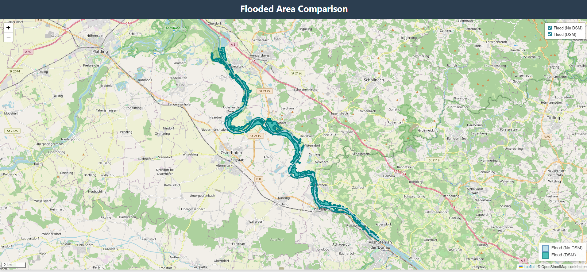

# Flood Area Mapping – Bavaria 2024

This project maps **flooded areas in Bavaria** using **Sentinel-1 SAR data** from two dates (May and June 2024) and performs **change detection** to identify flood extents. Results are produced **both with and without DSM** (Digital Surface Model):  

- **With DSM**: slope and elevation masking reduce false positives.  
- **Without DSM**: only SAR-based water detection is used.  

The interactive web map lets you compare both layers side by side.

---

## Web Map Preview

---

## Data Sources

- **Sentinel-1 SAR** – Used for flood detection (May & June 2024)  
- **InSAR DSM** – Digital Surface Model of the study area (for slope/elevation masking)  
- **EMSN 199 dataset** – Validation data from Copernicus Emergency Management Service  
  [EMSN 199](https://riskandrecovery.emergency.copernicus.eu/EMSN199/)

---

## Methodology

1. Preprocess Sentinel-1 data for both dates (VV/VH bands; optional DSM masking).  
2. Perform **change detection** to identify flood-affected areas (flood = water in post, not in pre).  
3. Compare results with **EMSN 199 reference dataset** for validation.  
4. Generate **interactive web map** using Leaflet for visualization.

---

## Results

The pipeline produces **two outputs**: flood **without DSM** and flood **with DSM** (e.g., slope threshold 60°). Both are validated against EMSN 199.

**Example metrics (with DSM, slope 60°):**

|                 | Predicted No Flood | Predicted Flood |
|-----------------|------------------|----------------|
| **No Flood**    | 2,924,430        | 12,125         |
| **Flood**       | 23,685           | 39,535         |

- **F1-score:** ~0.69  
- **IoU:** ~0.52  

**Comparison with/without DSM:**  
- Metrics are similar (~0.69 F1, ~0.52 IoU)  
- With DSM slightly reduces flood area on steep slopes  
- The web map allows side-by-side visual comparison

Results show good agreement with EMSN 199. Improvements are possible by tuning slope/elevation thresholds or adding additional datasets (DEM, spectral data, etc.).

---

## Future Work

- Incorporate **spectral datasets** to improve detection accuracy.  
- Extend analysis to **larger temporal coverage** for seasonal flood monitoring.  
- Optimize web map for **faster loading and interactive analytics**.